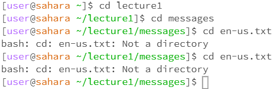
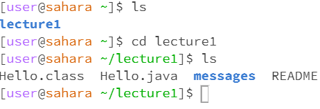
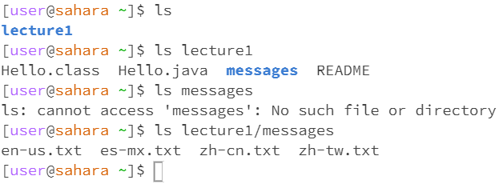
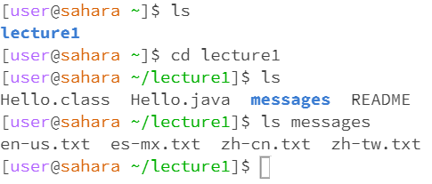
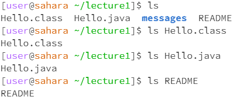
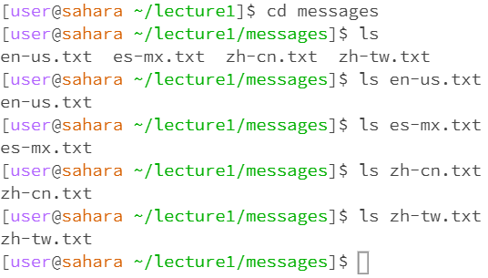
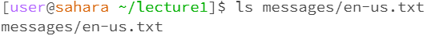
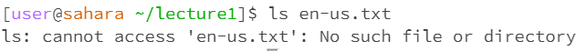
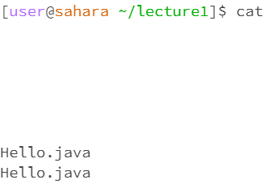
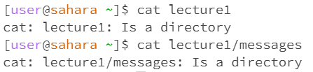

# Lab Report 1 
## 1. cd Command Examples
**a ) Command with no arguments**  
  
  
There is no output in the terminal, but running the command cd will reset the directory to home. If the current directory is home, it seems like nothing has changed. Changing the directory to lecture1 before running the command will change the directory to home after the command is run. In the beginning, the command line shows the directory as [user@sahara ~]. Changing the directory to lecture1 makes it [user@sahara ~ lecture1]. Having no arguments at the end of the command is the same thing as changing the directory to " ", which was the case at the very beginning.

**b ) Command with path to directory argument**  
  
  
There is no output, but the directory was changed depending on the path given. Using the cd command while in a directory allows the user to access other directories within the current directory, such as the messages directory within the lecture1 directory. However, skipping straight to the directory within another directory will produce an error output in the terminal, like using the command cd messages while not within the lecture1 directory. This error is expected, as cd cannot open every directory to check for other directories; cd can only check for matching directories that show up with the command ls.

**c ) Command with path to file argument**  
  
It is not possible to use the cd command with a file name as an argument, regardless if we are in the messages directory containing the Hello World files or any other directory. The output in the terminal tells us that there is an error - the file we tried to use as an argument with the cd command is not a valid directory. This error output is expected since cd is meant to change directories, not change files.  

## 2. ls Command Examples
**a ) Command with no arguments**  
  
Using ls without any arguments shows us all the directories and files that are in the current directory as an output. Any accessible directories are shown in blue font, while files are shown in black font. This output makes sense since the ls command is meant to just list out the contents of a directory. 

**b ) Command with directory arguments**  
  
  
Using ls with a directory as an argument will show us the files and directories in the directory listed as the argument in the terminal output. However, the output will only show those files if it is accessible from the current directory. For example, when in the home directory, we can only get an output from the command ls lecture1, not ls messages. Using the ls messages command produces an output that tells us that there is no such directory as messages, which makes sense since we cannot directly see that there is a messages directory from the lecture1 directory. The only way we can see the files in the messages directory using the ls command from the home directory is by typing out the whole pathway, such as ls lecture1/messages. Otherwise, we need to use the cd command to change directory to lecture1 first, then we are now able to use ls messages.   
**c ) Command with file arguments**  
  
  
  
  
Using ls with a file name as an argument will produce an output repeating the file name. Using either the absolute path or the relative path to the file name will produce the same output. However, if the argument is a relative path and the file is not in the current directory, then the output will be an error saying that there is no such file.  

## 3. cat Command Examples
**a ) Command with no arguments**  
  
It is not possible to use the cat command with no arguments. When pressing enter, the command terminal does not detect that the command is finished; pressing enter to try to end the command will only keep creating blank lines. In order for me to use the terminal afterward, I had to enter a file name to end the command.  

**b ) Command with directory arguments**  
  

