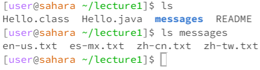
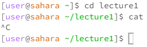
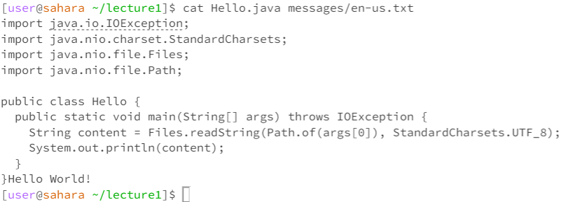

# Lab Report 1 
## 1. cd Command Examples
**a ) Command with no arguments**  
  
  
- In the first example, the working directory is the home directory. In the second example, the working directory is the lecture1 directory.
- In the home directory, there is no output when we run the cd command. The directory does not change from the home directory after the cd command. In the lecture1 directory, there is no terminal output after running the cd command, but the working directory changes to the home directory. In general, using cd without arguments makes the working directory the home directory. 
- This behavior is expected and not an error. 

**b ) Command with path to directory argument**  
  
- In the first example of the cd command being used, the working directory is the home directory. In the second example, the working directory is the lecture1 directory which was changed from the home directory as a result of the first cd command. In the last example, the working directory is the home directory.
- Using the cd command with a path to directory argument did not produce an output in the terminal, but changed the directory from the home directory to the lecture1 directory to the messages directory. However, we cannot change to the messages directory directly from the home directory. Doing so will produce a message saying that there are no files or directories named messages.
- The behavior for changing directories from home to lecture1 to messages is expected. The output message when we try to change from home to messages is expected and not an error, since we cannot directly find the messages directory from the home directory, as /home/messages is not a valid path.
  
**c ) Command with path to file argument**  
  
- The working directory is the messages directory that contains the Hello World! text files.
- Using the cd command with a file name as an argument produces a message saying that the given name is not a valid directory. 
- This behavior is expected and not an error, since the cd command is used to change directories that contain files within them, not files themselves. In order to try to access a file, we should use the cat command, which prints out the contents of a file.

## 2. ls Command Examples
**a ) Command with no arguments**  
  
- In the first example, the working directory is the home directory. In the second example, the working directory is the lecture1 directory. 
- Using the ls command without arguments lists out all the files and directories in the current directory. In the output, the directories and files are listed in blue text and black text respectively in alphabetical order.
- This behavior and output is expected, since the ls command is meant to list out what is inside of a directory, which are files and other directories. 

**b ) Command with directory arguments**  
  
  
- In the first example, the directory is the lecture1 directory. In the second example, the directory is the home directory.
- When using the command "ls messages" in the lecture 1 directory, we are able to see the different Hello World! language files that exist in the messages directory. However, we cannot use ls messages in the home directory, since we are not able to directly access the messages directory from the home directory.
- This output makes sense and is not an error. We can use cd to change to the messages directory in the lecture1 directory, but not in the home directory, so it would make sense that we can access the messages directory from the lecture1 directory, but not the home directory.

**c ) Command with file arguments**  
  
  
- In the first example, the directory is the messages directory. In the second example, the directory is the home directory.
- When using the ls command with a file name as an argument, the output in the terminal is the file name. We cannot use the ls command with a file name that is not in the current directory. Doing so will produce a message saying that there is no such file or directory.
- This behavior is expected, since the ls command prints out all files and directories. If we pass a file argument, then the file name is the only thing that can be printed out. The behavior of using the command "ls en-us.txt" in the home directory is expected, since this same behavior is also shown in the command with directory arguments. The file system doesn't recognize that there is a file called "en-us.txt" in the home directory, so this behavior is not an error. 

## 3. cat Command Examples
**a ) Command with no arguments**  
  
- The current working directory is lecture 1.
- When using the cd command without any arguments, the command doesn't do anything. The terminal waits for the user to input an argument in order to execute the command. To escape the command, I used control + C.
- This behavior is expected. The empty argument tells the cat command to get its argument from standard input stdin, which on the terminal is the user input. Needing input from the stdin explains why the terminal didn't immediately provide an error message for invalid argument or not enough arguments, as we could still give our argument to run the command.
  
**b ) Command with directory arguments**  
  
- The working directory in the example is the home directory.
- Using the cat command with a directory as an argument gives an output where the terminal simply tells us that the argument provided is a directory.
- This behavior is expected. The cat command is used to print out all the contents of a file. Since there's no contents to print out in a directory, only files and other directories, it is expected that we cannot use the cat command on a directory. 

**c ) Command with file arguments**  
  
- The working directory in the example is lecture1.
- Using the cat command with paths of files as arguments prints out the contents of the files listed. We can list multiple file paths in one command line, and the contents of all the files listed would be printed out in the order they are listed in the argument.
- This behavior is expected, since the cat command is meant to read the data within files and print it out. The word concatenate (where "cat" is from) means to link things together, so being able to print out multiple files one after the other also makes sense and is expected. 
