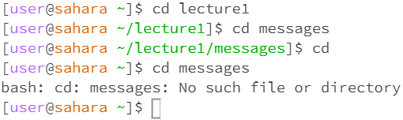

# Lab Report 1 
## 1. cd Command Examples
**a ) Command with no arguments**  
  
  
There is no output in the terminal, but running the command cd will reset the directory to home. If the current directory is home, it seems like nothing has changed. Changing the directory to lecture1 before running the command will change the directory to home after the command is run. In the beginning, the command line shows the directory as [user@sahara ~]. Changing the directory to lecture1 makes it [user@sahara ~ lecture1]. Having no arguments at the end of the command is the same thing as changing the directory to " ", which was the case at the very beginning.

**b ) Command with path to directory argument**  
  
  
There is no output, but the directory was changed depending on the path given. Using the cd command while in a directory allows the user to access other directories within the current directory, such as the messages directory within the lecture1 directory. However, skipping straight to the directory within another directory will produce an error output in the terminal, like using the command cd messages while not within the lecture1 directory. This error is expected, as cd cannot open every directory to check for other directories; cd can only check for matching directories that show up with the command ls.
