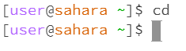
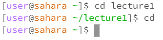
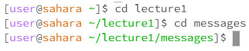

# Lab Report 1 
## 1. cd Command Examples
**a ) Command with no arguments**  
  
  
There is no output in the terminal, but running the command cd will reset the directory to home. If the current directory is home, it seems like nothing changes. Changing the directory to lecture1 before running the command will change the directory to home after the command is run.

**b ) Command with path to directory argument**  
  
There is no output, but the directory was changed depending on the path given. 
