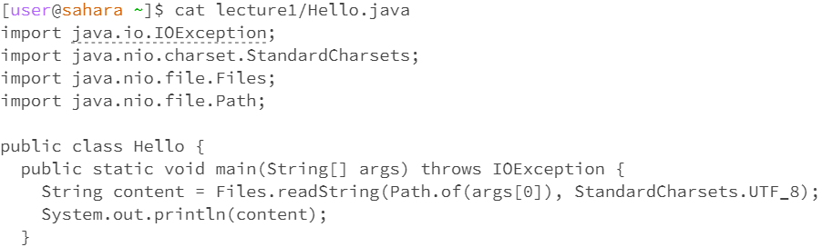
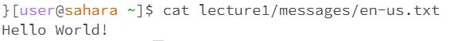
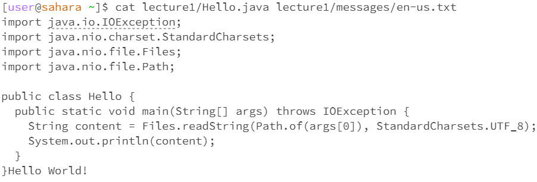

# Lab Report 1 
## 1. cd Command Examples
**a ) Command with no arguments**  
  
  
- In the first example, the working directory is the home directory. In the second example, the working directory is the lecture1 directory.
- In the home directory, there is no output when we run the cd command. The directory does not change from the home directory after the cd command. In the lecture1 directory, there is no terminal output after running the cd command, but the working directory changes to the home directory. In general, using cd without arguments makes the working directory the home directory. 
- This behavior is expected and not an error. 

**b ) Command with path to directory argument**  
  
- In the first example of the cd command being used, the working directory is the home directory. In the second example, the working directory is the lecture1 directory which was changed from the home directory as a result of the first cd command. In the last example, the working directory is the home directory.
- Using the cd command with a path to directory argument did not produce an output in the terminal, but changed the directory from the home directory to the lecture1 directory to the messages directory. However, we cannot change to the messages directory directly from the home directory. Doing so will produce a message saying that there are no files or directories named messages.
- The behavior for changing directories from home to lecture1 to messages is expected. The output message when we try to change from home to messages is expected and not an error, since we cannot directly find the messages directory from the home directory, as /home/messages is not a valid path.
  
**c ) Command with path to file argument**  
  
- The working directory is the messages directory that contains the Hello World! text files.
- Using the cd command with a file name as an argument produces a message saying that the given name is not a valid directory. 
- This behavior is expected and not an error, since the cd command is used to change directories that contain files within them, not files themselves. In order to try to access a file, we should use the cat command, which prints out the contents of a file.

## 2. ls Command Examples
**a ) Command with no arguments**  
  
- In the first example, the working directory is the home directory. In the second example, the working directory is the lecture1 directory. 
- Using the ls command without arguments lists out all the files and directories in the current directory. In the output, the directories and files are listed in blue text and black text respectively in alphabetical order.
- This behavior and output is expected, since the ls command is meant to list out what is inside of a directory, which are files and other directories. 

**b ) Command with directory arguments**  
  
  
Using ls with a directory as an argument will show us the files and directories in the directory listed as the argument in the terminal output. However, the output will only show those files if it is accessible from the current directory. For example, when in the home directory, we can only get an output from the command ls lecture1, not ls messages. Using the ls messages command produces an output that tells us that there is no such directory as messages, which makes sense since we cannot directly see that there is a messages directory from the lecture1 directory. The only way we can see the files in the messages directory using the ls command from the home directory is by typing out the whole pathway, such as ls lecture1/messages. Otherwise, we need to use the cd command to change directory to lecture1 first, then we are now able to use ls messages.   
**c ) Command with file arguments**  
  
  
  
  
Using ls with a file name as an argument will produce an output repeating the file name. Using either the absolute path or the relative path to the file name will produce the same output. However, if the argument is a relative path and the file is not in the current directory, then the output will be an error saying that there is no such file.  

## 3. cat Command Examples
**a ) Command with no arguments**  
  
It is not possible to use the cat command with no arguments. When pressing enter, the command terminal does not detect that the command is finished; pressing enter to try to end the command will only keep creating blank lines. In order for me to use the terminal afterward, I had to enter a file name to end the command.  

**b ) Command with directory arguments**  
  
Using the cat command with a directory as an argument is possible, but the command terminal will only show an output telling us that the directory is an argument. This output is expected, since the cat command is meant to print out the contents of a file, and there are no file contents within a directory; we need to use cat on a file name to access file contents.  

**c ) Command with file arguments**  
  
  
  
Using the cat command with a valid file name prints out the contents of the file, regardless if it is a .java file or a .txt file. We can list multiple pathways to multiple files in one cat command line to print out the contents of multiple files at the same time, such as cat lecture1/Hello.java lecture1/messages/en-us.txt. 
