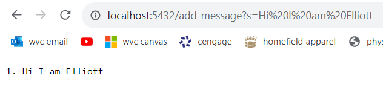
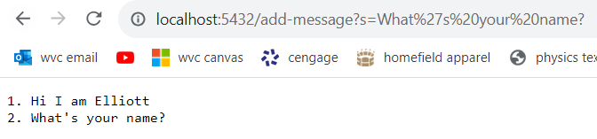

# Lab Report 2  
## Part 1: StringServer  
The below block is the code used in the file StringServer.java  

```
import java.io.IOException;
import java.net.URI;

class Handler implements URLHandler {
    // The one bit of state on the server: a number that will be manipulated by
    // various requests.
    String str = "";
    int count = 0;
    public String handleRequest(URI url) {
        if (url.getPath().equals("/")) {
            return "add strings to the list below";
        } else if (url.getPath().contains("/add-message")) {
            String[] parameters = url.getQuery().split("=");
            count = count + 1;
            if (parameters[0].equals("s")) {
                    str = str + Integer.toString(count) + ". "+ parameters[1] + "\n";
                    return str;
            }
        } 
        else if (url.getPath().contains("/clear")){
            str = "";
            count = 0;
            return "add strings to the list below";
        }
            return "404 Not Found!";
    }
}

class StringServer {
    public static void main(String[] args) throws IOException {
        if(args.length == 0){
            System.out.println("Missing port number! Try any number between 1024 to 49151");
            return;
        }

        int port = Integer.parseInt(args[0]);

        Server.start(port, new Handler());
    }
}
```

The below screenshots show the StringServer being run with commands.  
  
 
In the handler class that is used by StringServer, I defined a string str as ` "" ` and an integer count as `0`. The string str will be the string where the added messages are added on and returned 
and the integer count helps keep track of the current line, allowing us to print out a number and a period corresponding to what number the message is on the list of messages. 
The method called is public String handleRequest(URI url). The method takes in a URI argument, which is the URL `https://localhost5432/add-message?s=Hi%20I%20am%20Elliott`, changed from the original 
URL `https://localhost5432` as a result of user input in the search bar. When this method is called, 
an array of strings called parameters is created, which splits the contents of the query following the path based on the location of the character `=`. The contents before the `=`, which contain the query,
are put into the parameters array  at index 0 (`parameters[0]`) and the contents after the `=`, which contain the message, are put into the parameters array at index 1 (`parameters[1]`). 
The values of str and count then change. The integer count is increased by one. The string str is changed to attach the count - turned into String format by the method `Integer.toString(int)` - with a period, 
the message contained in `parameters[1]`, and then finally a new line `"\n"` to ensure the next message added does not attach in the same line.  

  
