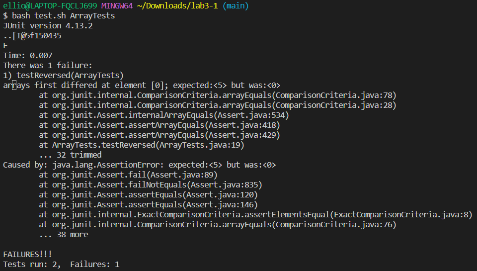
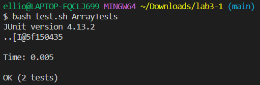
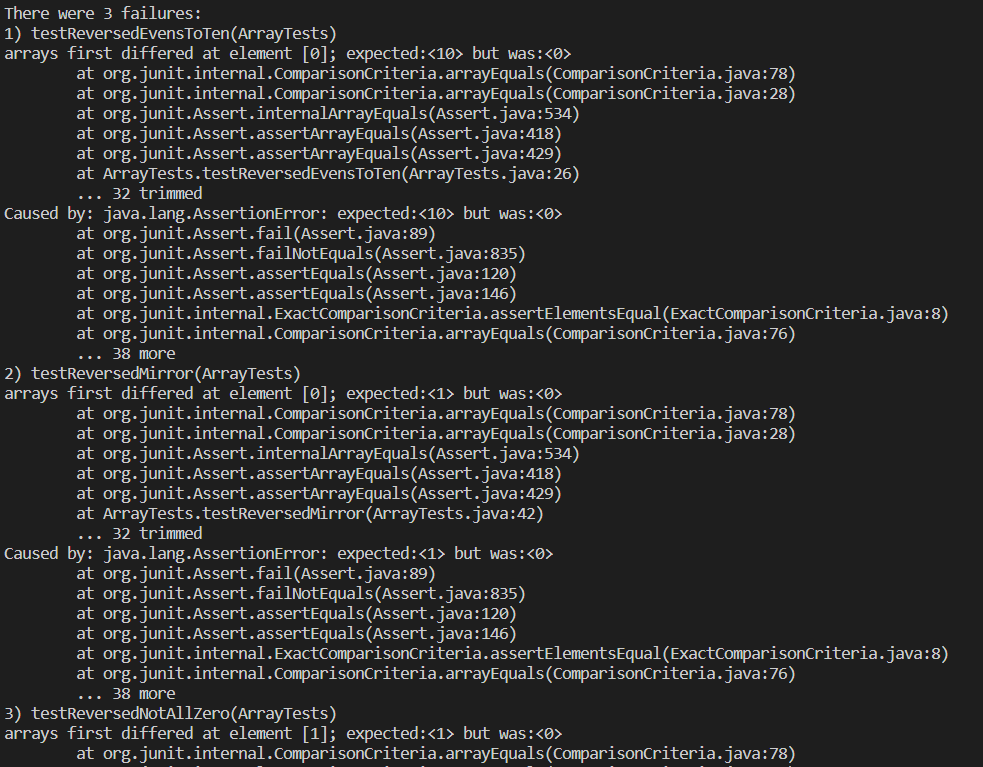
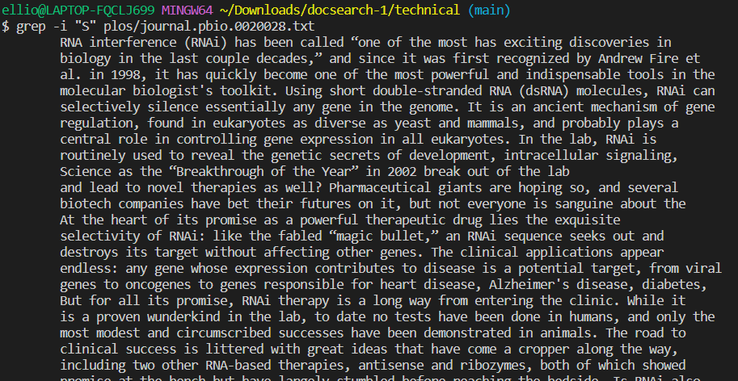
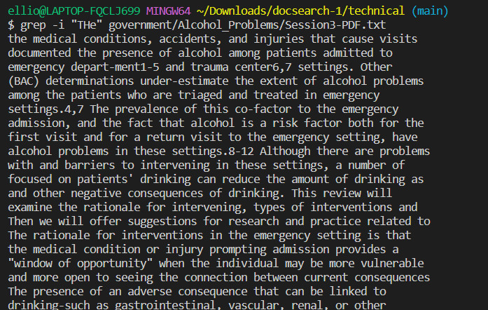
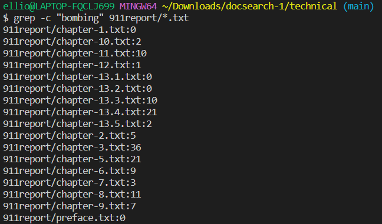
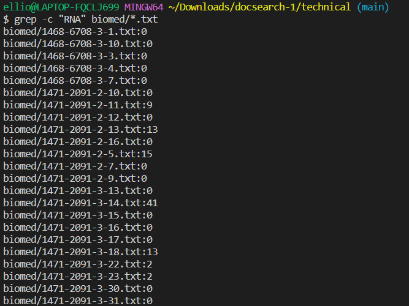

# Lab Report 3  
## Part 1: Bugs 
The method I will use is int[] reversed(int[] arr) in ArrayExamples.java. Below is the initial buggy code.  
```
static int[] reversed(int[] arr) {
    int[] newArray = new int[arr.length];
    for(int i = 0; i < arr.length; i += 1) {
      arr[i] = newArray[arr.length - i - 1];
    }
    return arr;
  }
```
**1. A failure-inducing input for the buggy program**
   
Inserting the array [1, 2, 3, 4, 5] into the method reversed() produces a failure in JUnit testing. Below is the code used to conduct the JUnit Test.  
```
@Test
  public void testReversed() {
    int[] input1 = {1, 2, 3, 4, 5};
    int [] expectedResult = {5, 4, 3, 2, 1};
    assertArrayEquals(expectedResult, ArrayExamples.reversed(input1));
  }
```
Below attached is the screenshot for the resulting terminal output.  
  

**2. An input that doesn’t induce a failure**
Inserting the array [0, 0, 0, 0, 0] into the method reversed() does not produce a failure in JUnit testing. Below is the code used to conduct the JUnit Test.  
```
@Test
  public void testReversed() {
    int[] input1 = {0, 0, 0, 0, 0};
    int [] expectedResult = {0, 0, 0, 0, 0};
    assertArrayEquals(expectedResult, ArrayExamples.reversed(input1));
  }
```
Below attached is the screenshot for the resulting terminal output.  
  

**3. The symptom, as the output of running the tests**  
The symptom is that all values of the supposedly reversed array are replaced by 0. In the failures of JUnit testing, 
all expected values are marked to be a comparison error since the expected value is not equal to 0. Below are more tests 
showing that only arrays with all 0 values successfully have their arrays reversed.  
```
  @Test
  public void testReversedThreeZeros() {
    int[] input1 = {0, 0, 0};
    int [] expectedResult = {0, 0, 0};
    System.out.println(ArrayExamples.reversed(input1));
    assertArrayEquals(expectedResult, ArrayExamples.reversed(input1));
  }

  @Test
  public void testReversedTwoZeros() {
    int[] input1 = {0, 0};
    int [] expectedResult = {0, 0};
    System.out.println(ArrayExamples.reversed(input1));
    assertArrayEquals(expectedResult, ArrayExamples.reversed(input1));
  }

  @Test
  public void testReversedEvensToTen() {
    int[] input1 = {2, 4, 6, 8, 10};
    int [] expectedResult = {10, 8 , 6, 4, 2};
    System.out.println(ArrayExamples.reversed(input1));
    assertArrayEquals(expectedResult, ArrayExamples.reversed(input1));
  }

  @Test
  public void testReversedNotAllZero(){
    int[] input1 = {0, 1, 0};
    int [] expectedResult = {0, 1, 0};
    System.out.println(ArrayExamples.reversed(input1));
    assertArrayEquals(expectedResult, ArrayExamples.reversed(input1));
  }

  @Test
  public void testReversedMirror(){
    int[] input1 = {1, 2, 3, 4, 4, 3, 2, 1};
    int [] expectedResult = {1, 2, 3, 4, 4, 3, 2, 1};
    System.out.println(ArrayExamples.reversed(input1));
    assertArrayEquals(expectedResult, ArrayExamples.reversed(input1));
  }
```
The screenshot below shows the terminal output after all the above tests are run together. 
  
The only tests to pass were the tests with inputs of all zeroes in the array. Every other test shows a failure with the error being a 
comparison difference of the expected value vs 0 at the index where the first non-zero expected value appears.  

**4. The bug, as the before-and-after code change required to fix it** 
Below is the before code:  
```
static int[] reversed(int[] arr) {
    int[] newArray = new int[arr.length];
    for(int i = 0; i < arr.length; i += 1) {
      arr[i] = newArray[arr.length - i - 1];
    }
    return arr;
  }
```
Below is the after code that fixes the bug:  
```
static int[] reversed(int[] arr) {
    int[] newArray = new int[arr.length];
    for (int i = 0; i<arr.length; i++){
      newArray[i] = arr[arr.length-1-i];
    }
    return newArray;
  }
```
In the before code, the for loop assigns values from the newly created Array to the original array backward. 
However, since newArray was created without having a value assigned, the value at every index was assigned 0 by default. 
Then assigning values from newArray to arr would make arr, the returned array, all 0s as well. The after code assigns values from arr to 
newArray, ensuring that the values being assigned to the return array are not all 0s.  


## Part 2: Researching Commands  
The command I will research is grep. 
1. Option 1: -l  
   Using -l gives the names of files that contain the word searched for. The output is only the file names.
   <br/><br/>
   Example 1: Using the command `grep -l "RNA" technical/biomed/*.txt` would have the following output:  
   ```
   $ grep -l "RNA" technical/biomed/*.txt
   technical/biomed/1471-2091-2-11.txt
   technical/biomed/1471-2091-2-13.txt
   technical/biomed/1471-2091-2-5.txt
   technical/biomed/1471-2091-3-14.txt
   technical/biomed/1471-2091-3-18.txt
   technical/biomed/1471-2091-3-22.txt
   technical/biomed/1471-2091-3-23.txt
   technical/biomed/1471-2105-2-1.txt
   technical/biomed/1471-2105-2-8.txt
   technical/biomed/1471-2105-3-17.txt
   technical/biomed/1471-2105-3-18.txt
   technical/biomed/1471-2105-3-2.txt
   technical/biomed/1471-2105-3-22.txt
   ```  
   This command can be useful in situations where we want to read about certain medical research ideas and findings on RNA. Giving us the file names that contain     the word "RNA" can help guide us to identify which articles to read about for information on RNA, instead of needing to go through all files to check for the     word "RNA".
   <br/><br/>
   Example 2: Using the command `grep -l "Clean Air Act" technical/government/*/*.txt` would have the following output:
   ```  
   $ grep -l "Clean Air Act" technical/government/*/*.txt
   technical/government/Env_Prot_Agen/bill.txt
   technical/government/Env_Prot_Agen/final.txt
   technical/government/Env_Prot_Agen/jeffordslieberm.txt
   technical/government/Env_Prot_Agen/multi102902.txt
   technical/government/Env_Prot_Agen/nov1.txt
   technical/government/Env_Prot_Agen/ro_clear_skies_book.txt
   technical/government/Env_Prot_Agen/section-by-section_summary.txt
   technical/government/Env_Prot_Agen/tech_adden.txt
   technical/government/Gen_Account_Office/og96026.txt
   technical/government/Gen_Account_Office/og96027.txt
   technical/government/Gen_Account_Office/og96042.txt
   technical/government/Gen_Account_Office/og96045.txt
   technical/government/Gen_Account_Office/og97045.txt
   technical/government/Gen_Account_Office/og98045.txt
   technical/government/Gen_Account_Office/og98046.txt
   ```  
   This would be useful if we wanted to read more about the contents of the Clean Air Act and amendments/discussions on it. Giving us the file names that contain     the term "Clean Air Act" can help guide us to identify which articles to read about for information on RNA, instead of needing to go through all files to check for the word "Clean Air Act".
   <br/><br/>
   The -l command option was researched on [Wikibooks](https://en.wikibooks.org/wiki/Grep): https://en.wikibooks.org/wiki/Grep 
   <br/><br/>
2. Option 2: -n
   Using -n with the grep command outputs a line number in front of the matching line found with the grep command.
   Example 1: Using the command `grep -n "At 8:19" technical/911report/chapter-1.txt` produces the following output
   ```
   $ grep -n "At 8:19" technical/911report/chapter-1.txt
   76:    At 8:19, Ong reported:"The cockpit is not answering, somebody's stabbed in business class
   and I think there's Mace that we can't breathe
   I don't know, I think we're getting hijacked." She then told of the stabbings of the two flight attendants.  
   ```
   This can be useful if we know that we stopped reading a certain file midway through, and want to pick up where we left off again. We most likely would remember some words of the last line we read instead of the line number, so we can find which line we start to read again from easily.
   <br/><br/>
   Example 2: Using the command `grep -n "intoxication" technical/government/Alcohol_Problems/*.txt` produces the following output:
   ```
   technical/government/Alcohol_Problems/Session2-PDF.txt:27:screening for several alcohol endpoints. Acute intoxication is of
   technical/government/Alcohol_Problems/Session2-PDF.txt:31:observations, may help us identify intoxication. Most alcohol
   technical/government/Alcohol_Problems/Session2-PDF.txt:89:ED problems, such as stress, injury, acute illness, intoxication,
   technical/government/Alcohol_Problems/Session2-PDF.txt:136:course, BAC can help identify acute intoxication. The alcohol
   technical/government/Alcohol_Problems/Session2-PDF.txt:270:identify intoxication. The presence of alcohol may not always
   technical/government/Alcohol_Problems/Session2-PDF.txt:378:especially acute intoxication, from 9% to 31%.17,28,46,68-71 Within
   technical/government/Alcohol_Problems/Session2-PDF.txt:456:alcohol intoxication and chronic alcohol abuse on outcome from
   technical/government/Alcohol_Problems/Session2-PDF.txt:467:intoxication in alcoholics. J Consult Clin Psychol
   technical/government/Alcohol_Problems/Session2-PDF.txt:479:acute alcohol intoxication and chronic alcohol dependence by trauma
   technical/government/Alcohol_Problems/Session3-PDF.txt:506:that 26 of 31 respondents indicated that intoxication at the time
   technical/government/Alcohol_Problems/Session3-PDF.txt:585:11. Lowenstein SR, Weissberg MP, Terry D. Alcohol intoxication,
   technical/government/Alcohol_Problems/Session3-PDF.txt:711:surveillance of alcohol intoxication after motor vehicular
   technical/government/Alcohol_Problems/Session4-PDF.txt:633:acute alcohol intoxication and chronic alcohol dependence by trauma
   technical/government/Alcohol_Problems/Session4-PDF.txt:636:of police assessment of driver intoxication in motor vehicle
   technical/government/Alcohol_Problems/Session4-PDF.txt:1039:patients with acute alcohol intoxication on a daily basis, but
   ```
   This can be useful if we have a presentation or test coming up and need to do a quick review of certain topics. Using the -n command for certain words in a       directory can help us run through the entire directory and find the files and specific lines for us to read through for a quick recap. 

5. Option 3: -i
   Using -i with the grep command acts as usual, but the term is not case-sensitive. For example, searching for the character "a" and "A" would be the same thing
   if using -i. This is useful since some words can be both capitalized and lowercase depending on their usage. Using "-i" would remove any chance we miss some
   matching lines due to these situations.
   
   

6. Option 4: -c
   Using -c doesn't output any matching lines but instead outputs a number that tells us how many lines have the word we searched for with the grep command.
   This can be useful to use with the -n command. We can use -c to find if certain files have the topic or word we are looking for, and then use -n to find
   exactly where they are.
     
   

## Citation
All command options were researched on [Wikibooks](https://en.wikibooks.org/wiki/Grep)
   

   
