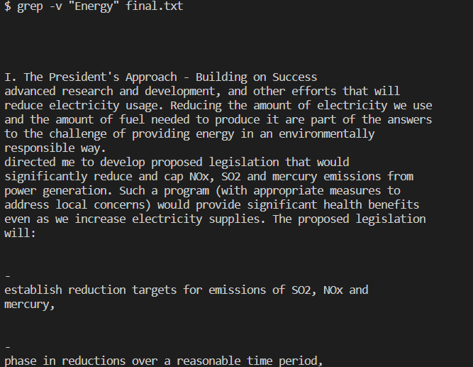
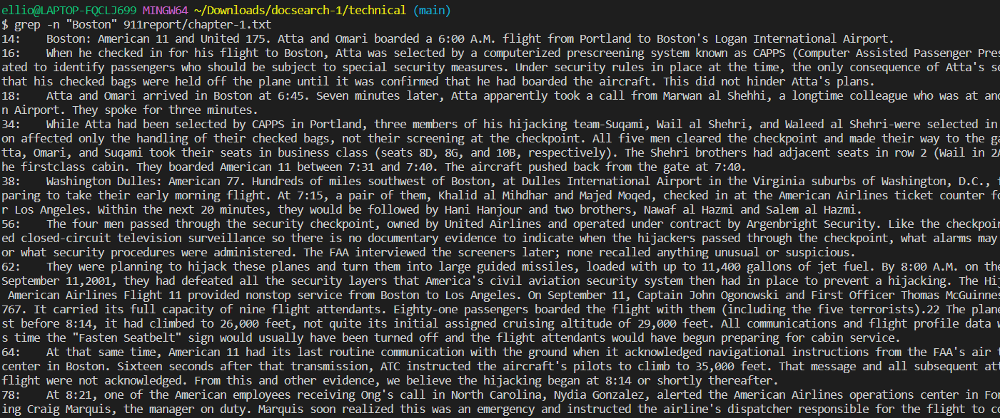

# Lab Report 3  
## Part 1: Bugs 
The method I will use is int[] reversed(int[] arr) in ArrayExamples.java. Below is the initial buggy code.  
```
static int[] reversed(int[] arr) {
    int[] newArray = new int[arr.length];
    for(int i = 0; i < arr.length; i += 1) {
      arr[i] = newArray[arr.length - i - 1];
    }
    return arr;
  }
```
**1. A failure-inducing input for the buggy program**
   
Inserting the array [1, 2, 3, 4, 5] into the method reversed() produces a failure in JUnit testing. Below is the code used to conduct the JUnit Test.  
```
@Test
  public void testReversed() {
    int[] input1 = {1, 2, 3, 4, 5};
    int [] expectedResult = {5, 4, 3, 2, 1};
    assertArrayEquals(expectedResult, ArrayExamples.reversed(input1));
  }
```
Below attached is the screenshot for the resulting terminal output.  
  

**2. An input that doesn’t induce a failure**
Inserting the array [0, 0, 0, 0, 0] into the method reversed() does not produce a failure in JUnit testing. Below is the code used to conduct the JUnit Test.  
```
@Test
  public void testReversed() {
    int[] input1 = {0, 0, 0, 0, 0};
    int [] expectedResult = {0, 0, 0, 0, 0};
    assertArrayEquals(expectedResult, ArrayExamples.reversed(input1));
  }
```
Below attached is the screenshot for the resulting terminal output.  
  

**3. The symptom, as the output of running the tests**  
The symptom is that all values of the supposedly reversed array are replaced by 0. In the failures of JUnit testing, 
all expected values are marked to be a comparison error since the expected value is not equal to 0. Below are more tests 
showing that only arrays with all 0 values successfully have their arrays reversed.  
```
  @Test
  public void testReversedThreeZeros() {
    int[] input1 = {0, 0, 0};
    int [] expectedResult = {0, 0, 0};
    System.out.println(ArrayExamples.reversed(input1));
    assertArrayEquals(expectedResult, ArrayExamples.reversed(input1));
  }

  @Test
  public void testReversedTwoZeros() {
    int[] input1 = {0, 0};
    int [] expectedResult = {0, 0};
    System.out.println(ArrayExamples.reversed(input1));
    assertArrayEquals(expectedResult, ArrayExamples.reversed(input1));
  }

  @Test
  public void testReversedEvensToTen() {
    int[] input1 = {2, 4, 6, 8, 10};
    int [] expectedResult = {10, 8 , 6, 4, 2};
    System.out.println(ArrayExamples.reversed(input1));
    assertArrayEquals(expectedResult, ArrayExamples.reversed(input1));
  }

  @Test
  public void testReversedNotAllZero(){
    int[] input1 = {0, 1, 0};
    int [] expectedResult = {0, 1, 0};
    System.out.println(ArrayExamples.reversed(input1));
    assertArrayEquals(expectedResult, ArrayExamples.reversed(input1));
  }

  @Test
  public void testReversedMirror(){
    int[] input1 = {1, 2, 3, 4, 4, 3, 2, 1};
    int [] expectedResult = {1, 2, 3, 4, 4, 3, 2, 1};
    System.out.println(ArrayExamples.reversed(input1));
    assertArrayEquals(expectedResult, ArrayExamples.reversed(input1));
  }
```
The screenshot below shows the terminal output after all the above tests are run together. 
  
The only tests to pass were the tests with inputs of all zeroes in the array. Every other test shows a failure with the error being a 
comparison difference of the expected value vs 0 at the index where the first non-zero expected value appears.  

**4. The bug, as the before-and-after code change required to fix it** 
Below is the before code:  
```
static int[] reversed(int[] arr) {
    int[] newArray = new int[arr.length];
    for(int i = 0; i < arr.length; i += 1) {
      arr[i] = newArray[arr.length - i - 1];
    }
    return arr;
  }
```
Below is the after code that fixes the bug:  
```
static int[] reversed(int[] arr) {
    int[] newArray = new int[arr.length];
    for (int i = 0; i<arr.length; i++){
      newArray[i] = arr[arr.length-1-i];
    }
    return newArray;
  }
```
In the before code, the for loop assigns values from the newly created Array to the original array backward. 
However, since newArray was created without having a value assigned, the value at every index was assigned 0 by default. 
Then assigning values from newArray to arr would make arr, the returned array, all 0s as well. The after code assigns values from arr to 
newArray, ensuring that the values being assigned to the return array are not all 0s.  


## Part 2: Researching Commands  
1. Option 1: -v
   Using -v gives the results of an inverted match; the output is the lines that don't include the word searched for.
   This can be useful if we want to read through a paper but don't want to read about certain topics.
   
   
   
2. Option 2: -n
   Using -n with the grep command outputs a line number in front of the matching line found with the grep command. This can be useful if we are
   trying to look for a key term and then read more about the term after finding matching lines in the file; the -n would let us know what line to start
   reading from.
     
   

3. Option 3: -i
   Using -i with the grep command acts as usual, but the term is not case-sensitive. For example, searching for the character "a" and "A" would be the same thing
   if using -i. This is useful since some words can be both capitalized and lowercase depending on their usage. Using "-i" would remove any chance we miss some
   matching lines due to these situations.
   
   

4. Option 4: -c
   Using -c doesn't output any matching lines but instead outputs a number that tells us how many lines have the word we searched for with the grep command.
   This can be useful to use with the -n command. We can use -c to find if certain files have the topic or word we are looking for, and then use -n to find
   exactly where they are.
     
   

## Citation
All command options were researched on [Wikibooks](https://en.wikibooks.org/wiki/Grep)
   

   
