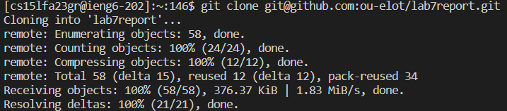
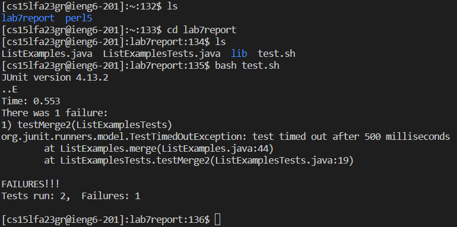
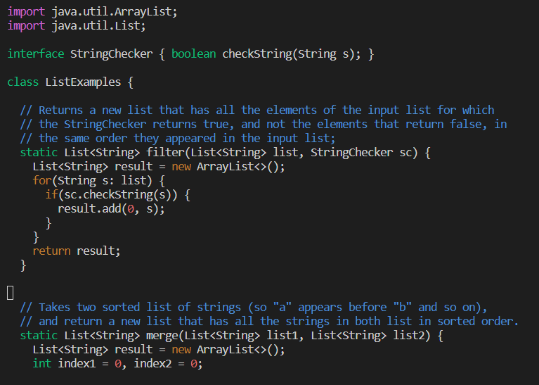
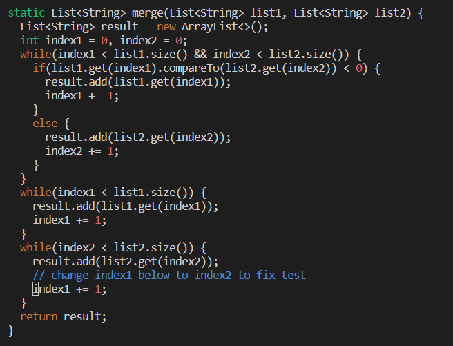
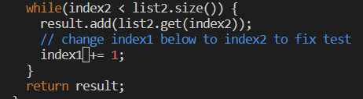
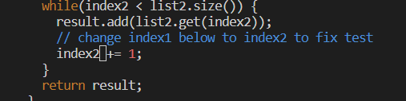
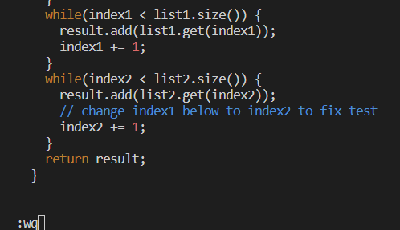
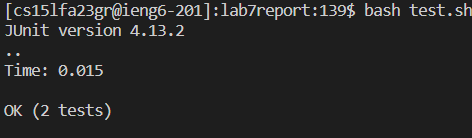
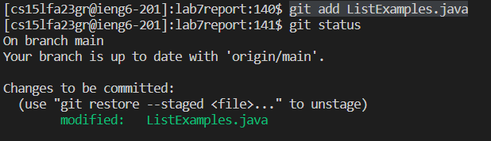
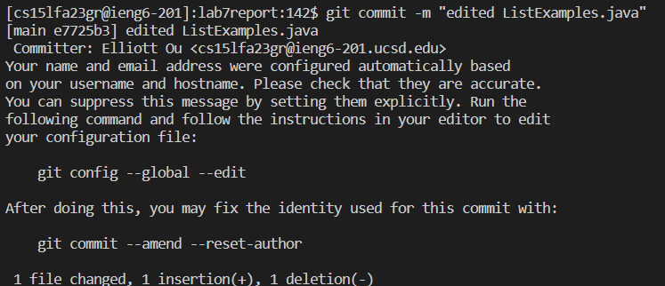

# Lab Report 4  
## Step 1: Log into ieng6  
I entered the following into my terminal to log into my ieng6 account: `ssh cs15lfa23gr@ieng6.ucsd.edu`  
  

## Step 2: Clone the git fork  
I entered the command `git clone git@github.com:ou-elot/lab7report.git` to clone my forked repository using the SSH url.  
    

## Step 3: Run the tests, demonstrating that they fail  
First, I changed my directory to lab7report using the ls and cd commands. Once I was in the lab7report directory, I ran the command `bash test.sh` to run the java tests to show that they failed. 
  

## Step 4: Edit the code file ListExamples.java to fix the failing test
I entered the command `vim ListExamples.java` to enter vim.
  
Using the failed test, I knew that the error was on line 44 of the file. 
I used the command `/index1` to search for instances of index1, since in order to fix the error, I needed to change the instance of index1 on line 44 to index2. 
I pressed the n and N keys to move through the instances. Since the index1 I needed to change was the 10th instance of index1, I pressed n 9 times.  
Buttons Pressed: `<n> <n> <n> <n> <n> <n> <n> <n> <n>`  
  
Once my cursor was at the correct line, I moved right 6 times using the `<l>` key to get to the space right after the 1 of index1.  
Buttons Pressed: `<l> <l> <l> <l> <l> <l>`  
  
Finally, I entered insert mode using `<i>`, deleted the 1 at the spot of my cursor, and then inserted a 2. 
Buttons Pressed: `<i> <backspace> <2>`   
  
I exited edit mode using the <esc> key, then saved by typing `:wq`  
 
Buttons Pressed for the entire step: 
```  
vim ListExamples.java  
/index1  
<n> <n> <n> <n> <n> <n> <n> <n> <n>  
<l> <l> <l> <l> <l> <l>  
<i> <backspace> <2>  
```  
## Step 5: Run the tests, demonstrating that they now succeed
Similar to step 3, I ran the command `bash test.sh`.  
  
The JUnit test now passes. 

## Step 6: Commit and push the resulting change to your Github account
I first ran the command `git add ListExamples.java`, then ran `git status` to check if the java file was successfully added into the changes.  
  
Afterwards, I ran the command `git commit -m "edited ListExamples.java"`
  
