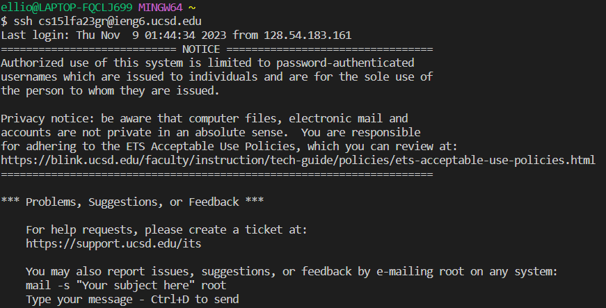
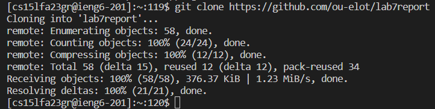

# Lab Report 4  
## Step 1: Log into ieng6  
I entered the following into my terminal to log into my ieng6 account: `ssh cs15lfa23gr@ieng6.ucsd.edu`  
  

## Step 2: Clone the git fork  
I entered the command `git clone https://github.com/ou-elot/lab7report` to clone my forked repository.  
    
