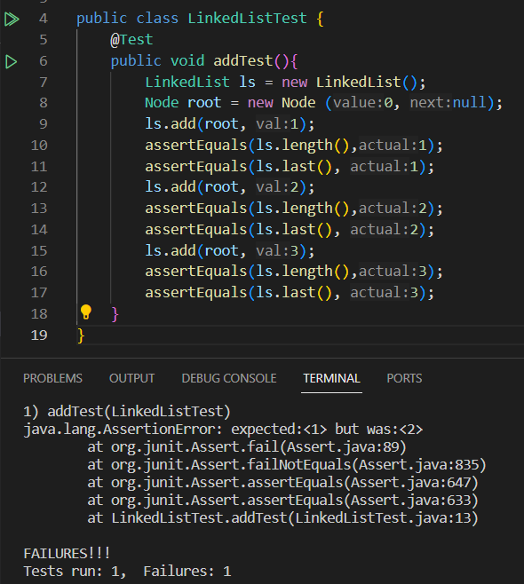

# Lab Report 5  
## Part 1: Debugging Scenario  
**1. Original Post From Student with a screenshot showing a symptom and a description of a guess at the bug/some sense of what the failure-inducing input is.**   
  
The post content is about code for Linked Lists, specifically a method trying to add a node at the end of the list. The student's code assigns a new Node (value_to_be_added, null) to current instead of current.next, essentially replacing the last node instead of adding a new node. The tests the student talks about in the post reference the methods `public int length (Node root)` and `public Node last (Node root)`. The method `public int length (Node root)` gives the total number of nodes in the linked list and the method `public int last (Node root)` gives the last node of the Linked List. These methods' bodies are not in the code block for the hypothetical EdStem post to not make the post too long and make it easier to focus on the buggy add method. Instead, methods `length` and `last` are listed below for context.  
```
public int length (Node root) {
     //case 1: if root == null, then length is 0
     if (root == null) {
          return 0;
     }
     //case 2: root != null, but root.next == null. Length is 1
     else if (root.next == null) {
          return 1;
     }
     //case 3: use awhile loop to run to the end, adding 1 every iteration to a counter
     else {
          int count = 0;
          while (root.next != null) {
               root = root.next;
               count = count + 1;
          }
          return count;
     }
}

public int last (Node root) {
     //case 1: root is null, case 2: root is not null, but root.next = null. 
     if (root == null ) {
          throw new NoSuchElementException();
     }
     else if (root.next == null) {
          return root.value;
     }
     //use a while loop to run to the end
     else {
          Node current = root;
          while (root.next != null) {
               current = root.next;
          }
          return current.value;
     }
}
```  
Below is the hypothetical EdStem post:
> Hi,
> I am currently working on the method `public void add (int val)`.
> Below is the code I currently have for the add method:
> ```
> public void add (Node root, int val) {
>     Node current = root;
>     //if root is null aka LinkedList is empty, then set (val, null) as new root.
>     if (this.root == null) {
>          this.root = new Node (val, null);
>     }
>     //moving down to the end of the LinkedList and adding a new Node
>     while(current.next != null) {
>          current = current.next;
>     }
>     current = new Node (val, null);
> }
> ```
> My current jUnit test tests for the length and the last node of the Linked List. Every time I run the test, the last node has the right node, but the length stays the same. I've looked at my code numerous times and can't seem to find the bug. What should I do next to fix this? The screenshots for my jUnit test results are attached below.  
>   
