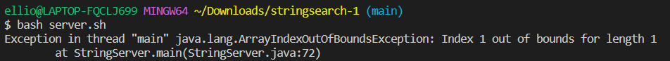
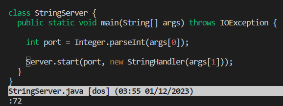
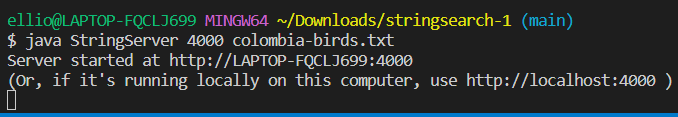
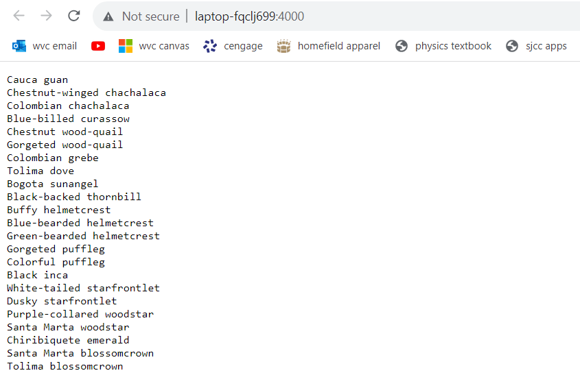
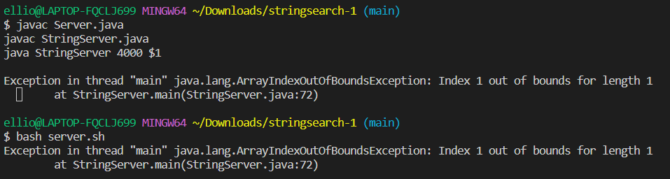

# Lab Report 5  
## Part 1: Debugging Scenario  
The files and directories referenced are from https://github.com/lim-rachel/stringsearch, the repository used for skill demo 1 accessible on prarielearn. The NumberSearch server referenced in the student post is from week 2 lab: https://ucsd-cse15l-f23.github.io/week/week2/  

**1. Original Post From Student with a screenshot showing a symptom and a description of a guess at the bug/some sense of what the failure-inducing input is**   
Below is a hypothetical EdStem post from a student:

>Unable to run StringServer. 
>
>Hi,
> I am currently trying to write a bash script that will run StringServer.
> Below is the following bash script I have written so far and a screenshot showing the output when I run the bash script:
>```
>javac Server.java
>javac StringServer.java
>java StringServer 4000
>```
> 
> I'm a little lost as to why the server isn't starting, as I'm using the same command format for NumberSearch server in lab. My current guess is that I am missing something in the java command to run the server since I don't see any compile errors in the output, so I think the files compiled correctly.  

The Symptom: Instead of being notified that the server is running on our local machine, we get an IndexOutOfBounds runtime error.  
Failure Inducing Input: `java StringServer 4000`, as shown above. 

**2. A response from a TA asking a leading question or suggesting a command to try** 
> Hi there!
> 
> You did indeed compile everything correctly. The error message shown is a runtime error, so there is something wrong with your java command. Use vim or VSCode to open StringServer.java, move to line 72, the line where the error occurs according to the output. 
>
> What is new on that line that the NumberSearch server we used in lab didn't have? Where in the file could we find what that new part is supposed to look like?

**3.Another screenshot/terminal output showing what information the student got from trying that, and a clear description of what the bug is.**   
  
The student ran the command `vim StringServer.java` to open the file and then `:72` to move to line 72. He saw that the start command included a new StringHandler[args(1)] argument, something that was not in the NumberServer shown in lab. Using the TA's hint that the format for the StringHandler[args(1)] argument was in the same file, the student found that the constructor for StringHandler needed a path to a file.   
Below is the new bash script, an example of the student running it, and the corresponding output: 
```
javac Server.java
javac StringServer.java
java StringServer 4000 $1
```
   
   
*Note: the screenshot of the server is not the whole server and is cut off since the list of birds is too long.  
The bug: The bug was that the original bash script did not include enough parameters to run the start method.  

**4. All the information needed about the setup**
a. The file & directory structure needed  
   Below was the file and directory structure used. Most of it can be obtained by git cloning the repository https://github.com/lim-rachel/stringsearch. The only file not in the clone would be the bash script.

   ```
   StringSearch/
       Server.java
       StringServer.java
       bridges.txt
       colombia-birds.txt
       words.txt
       session.log
       server.sh
   ```

b. The contents of each file before fixing the bug  
Below is the code for `Server.java`:
```
// A simple web server using Java's built-in HttpServer

// Examples from https://dzone.com/articles/simple-http-server-in-java were useful references

import java.io.IOException;
import java.io.OutputStream;
import java.net.InetSocketAddress;
import java.net.InetAddress;
import java.net.URI;

import com.sun.net.httpserver.HttpExchange;
import com.sun.net.httpserver.HttpHandler;
import com.sun.net.httpserver.HttpServer;

interface URLHandler {
    String handleRequest(URI url) throws Exception;
}

class ServerHttpHandler implements HttpHandler {
    URLHandler handler;
    ServerHttpHandler(URLHandler handler) {
      this.handler = handler;
    }
    public void handle(final HttpExchange exchange) throws IOException {
        // form return body after being handled by program
        try {
            String ret = handler.handleRequest(exchange.getRequestURI());
            // form the return string and write it on the browser
            exchange.sendResponseHeaders(200, ret.getBytes().length);
            OutputStream os = exchange.getResponseBody();
            os.write(ret.getBytes());
            os.close();
        } catch(Exception e) {
            String response = e.toString();
            exchange.sendResponseHeaders(500, response.getBytes().length);
            OutputStream os = exchange.getResponseBody();
            os.write(response.getBytes());
            os.close();
        }
    }
}

public class Server {
    public static void start(int port, URLHandler handler) throws IOException {
        HttpServer server = HttpServer.create(new InetSocketAddress(port), 0);

        //create request entrypoint
        server.createContext("/", new ServerHttpHandler(handler));

        //start the server
        server.start();
        System.out.println("Server started at http://" + InetAddress.getLocalHost().getHostName() + ":" + port);
        System.out.println("(Or, if it's running locally on this computer, use http://localhost:" + port + " )");
    }
}
```
Below is the code in `StringServer.java`: 
```
import java.io.BufferedWriter;
import java.io.FileWriter;
import java.io.IOException;
import java.io.PrintWriter;
import java.net.URI;
import java.nio.file.Files;
import java.nio.file.Paths;
import java.util.List;

class StringHandler implements URLHandler {
  List<String> lines;
  String path;
  StringHandler(String path) throws IOException {
    this.path = path;
    this.lines = Files.readAllLines(Paths.get(path));
  }
  public String handleRequest(URI url) throws IOException {
    String query = url.getQuery();
    if(url.getPath().equals("/add")) {
      if(query.startsWith("s=")) {
        String toAdd = query.split("=")[1];
        this.lines.add(toAdd);
        this.log("/add?" + query);
        return String.format("%s added, there are now %s lines\n", toAdd, this.lines.size());
      }
      else {
        return "/add requires a query parameter s\n";
      }
    }
    else if(url.getPath().equals("/save")) {
      String toSave = String.join("\n", lines) + "\n";
      Files.write(Paths.get(this.path), toSave.getBytes());
      this.log("/save");
      return "Saved!\n";
    }
    else if(url.getPath().equals("/search")) {
      if(query.startsWith("q=")) {
        String toSearch = query.split("=")[1];
        String result = "";
        for(String s: lines) {
          if(s.contains(toSearch)) {
            result += s + "\n";
          }
        }
        this.log("/search?" + query);
        return result;
      }
      else {
        return "/search requires a query parameter q\n";
      }
    }
    else {
      return String.join("\n", lines) + "\n";
    }
  }
  void log(String s) {
    try(FileWriter fw = new FileWriter("session.log", true);
        BufferedWriter bw = new BufferedWriter(fw);
        PrintWriter out = new PrintWriter(bw)) {
        out.println(s);
    } catch (IOException e) {
        //exception handling left as an exercise for the reader
    }
  }
}

class StringServer {
  public static void main(String[] args) throws IOException {
    if(args.length == 0){
      System.out.println("Missing port number! Try any number between 1024 to 49151");
      return;
    }
    if(args.length == 1){
      System.out.println("Missing file path! Give a path to a text file as the second argument.");
      return;
    }

    int port = Integer.parseInt(args[0]);

    Server.start(port, new StringHandler(args[1]));
  }
}
```
`session.log` is an empty file. 
The contents of `Columbia-birds.txt`, `bridges.txt`, and `words.txt` are not significant as any text file can be used to run the server, but the contents will be shown below.   
Content of `Columbia-birds.txt` :  
```
Cauca guan
Chestnut-winged chachalaca
Colombian chachalaca
Blue-billed curassow
Chestnut wood-quail
Gorgeted wood-quail
Colombian grebe
Tolima dove
Bogota sunangel
Black-backed thornbill
Buffy helmetcrest
Blue-bearded helmetcrest
Green-bearded helmetcrest
Gorgeted puffleg
Colorful puffleg
Black inca
White-tailed starfrontlet
Dusky starfrontlet
Purple-collared woodstar
Santa Marta woodstar
Chiribiquete emerald
Santa Marta blossomcrown
Tolima blossomcrown
Santa Marta sabrewing
Chestnut-bellied hummingbird
Indigo-capped hummingbird
Sapphire-bellied hummingbird
Santa Marta screech-owl
Sooty-capped puffbird
White-mantled barbet
Grayish piculet
Beautiful woodpecker
Rufous-fronted parakeet
Indigo-winged parrot
Turquoise-winged parrotlet
Santa Marta parakeet
Brown-breasted parakeet
Santa Marta antbird
East Andean antbird
Parker's antbird
Santa Marta antpitta
Cundinamarca antpitta
Sierra Nevada antpitta
Chami antpitta
```

Content of `bridges.txt`:  
```
Arch bridge
Through arch bridge
Beam bridge
Log bridge
Viaduct
Cavity wall viaduct
Bowstring arch
Box girder bridge
Cable-stayed bridge
Cable-stayed suspension bridge hybrid
Cantilever bridge
Cantilever spar cable-stayed bridge
Clapper bridge
Covered bridge
Girder bridge
Continuous span girder bridge
Integral bridge				
Extradosed bridge
Moon bridge
Movable bridge
Pigtail bridge
Plate girder bridge
Pontoon bridge
Rigid-frame bridge
Roving bridge
Segmental bridge
Self-anchored suspension bridge
Side-spar cable-stayed bridge
Simple suspension bridge
Step-stone bridge
Stressed ribbon bridge
Suspension bridge
Transporter bridge
Trestle bridge
Truss arch bridge
Truss bridge
Vierendeel bridge
Brown truss
Lattice truss bridge
Tubular bridge
Vlotbrug
```

Content of `words.txt`:  
```
good
luck
on
your
skill
demo
everyone
you
can
do
it
```

c. The full command line (or lines) you ran to trigger the bug  
Running the commands
```
javac Server.java
javac StringServer.java
java StringServer 4000 
```
would produce the bug. 

If the commands were put into a bash script, like `server.sh` in the file structure above, then simply running 
```
bash server.sh
```
would produce the bug

   
d. A description of what to edit to fix the bug  
adding a path to the file after the server port number would fix the bug. In my bash script, I used `$1` to give the user freedom in choosing what file to use when starting the server.   


## Part 2: Reflection  
Something really cool I learned was using vim and jdb. Vim doesn't feel any more faster to edit files for me, but having a new way to edit files makes it more fun, similar to getting a new gift. Jdb makes it a lot more convenient to print out things I want when debugging. I tried using jdb after learning it on some of my old buggy CSE12 PA submissions on gradescope. In order to fix this bugs, I had to write many lines of `System.out.println` for the terminal to output variables to try and find what could be wrong. Now, I can just type `locals` isntead of having to type `System.out.println` numerous times, making it a lot more convenient. 
